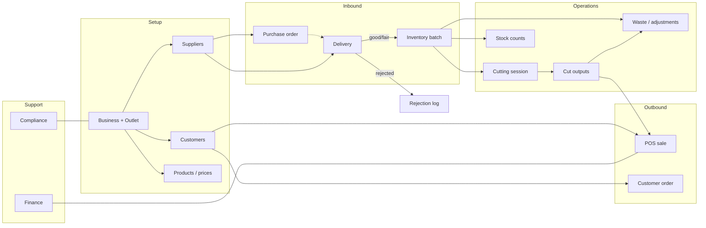

# Butcher Workspace — Modules, Navigation & Workflows

Reference for the **Butcher** tenant workspace in DayareMeat (BuchaPro). Generated from routes, controllers, services, models, FormRequests, sidebar navigation, and feature tests in the codebase.

---

## Overview

| Item | Detail |
|------|--------|
| **URL prefix** | `/butcher/*` |
| **Route name prefix** | `butcher.*` |
| **Middleware** | `auth`, `verified`, `tenant`, `workspace:butcher`, `tenant.permission` |
| **Tenant type** | `Business::TYPE_BUTCHER` (`'butcher'`) |
| **Butchery subtypes** | `retail`, `wholesale`, `mixed` on `businesses.butchery_type` |
| **Data scope** | Records tied to businesses from `User::accessibleButcherBusinessIds()` (owned + member butcher businesses) |
| **Permission model** | Butcher RBAC reuses `business_user.role` + `EnsureTenantPermission` (no longer excluded). Roles: Owner, Manager, Procurement Officer, Storekeeper, Processor, Cashier, Sales Officer, Accountant, Compliance Officer, Outlet Manager. Business **owners** always have full butcher access. Members with no butcher role are blocked (most restrictive). |
| **Hierarchy** | **Business (butcher)** → **Outlet** → **Supplier / Customer** → **Delivery → Inventory batch → Cutting session → Cut outputs → Sale / Order** |
| **Inventory ledger** | `butcher_inventory_movements` + `ButcherInventoryMovement::record()` — table ready; operational services not wired yet (later phases) |
| **Mobile / API** | No butcher endpoints under `/api/v1` (web workspace only) |
| **Default landing** | `butcher.dashboard` when the user’s primary workspace is butcher |

### Related documentation

| Document | Coverage |
|----------|----------|
| [FARMER_WORKSPACE.md](./FARMER_WORKSPACE.md) | Farmer tenant (parallel workspace) |
| [PROCESSOR_WORKSPACE.md](./PROCESSOR_WORKSPACE.md) | Processor tenant — note: facility type `Butchery` is a **processor site**, not this workspace |
| [DATABASE_SEEDERS.md](./DATABASE_SEEDERS.md) | Demo credentials / `ButcherWorkspaceDemoSeeder` |
| [SYSTEM_ANALYSIS.md](./SYSTEM_ANALYSIS.md) | Cross-workspace actors |

### Important distinction

| Concept | Meaning |
|---------|---------|
| **Butcher workspace** | Standalone tenant (`Business.type = butcher`) for retail/wholesale meat outlets |
| **Processor facility “Butchery”** | A facility type under a **processor** business — different module stack |

### Configuration fields (on `businesses`)

| Field | Default / notes |
|-------|-----------------|
| `butchery_type` | `retail` \| `wholesale` \| `mixed` |
| `rfa_permit_*` | RFA permit metadata |
| `butcher_district` / `sector` / `cell` | Location |
| `butcher_fresh_max_temp_c` | Default `4` |
| `butcher_frozen_max_temp_c` | Default `-18` |
| `butcher_batch_shelf_life_days` | Default `3` |

---

## Access & authorization

### Workspace detection

- `User::tenantWorkspaceType()` returns `'butcher'` when the user owns or belongs to a butcher business (per workspace resolution rules).
- `EnsureUserWorkspace` (`workspace:butcher`) returns **403** if the workspace type is not butcher.

### Scoping

Controllers use `InteractsWithAccessibleButcherBusiness` so records are limited to accessible butcher businesses. Cross-tenant IDs typically resolve as **404**.

### Onboarding

- Registration with `business_type = butcher` creates a **pending** butcher business and a default primary **outlet**.
- Users land on `butcher.dashboard`.
- Demo login (seeded): see `docs/DATABASE_SEEDERS.md` (e.g. `owner.butcher@demo.rw`).

### Roles / permissions

Butcher uses the same `business_user` pivot as processor, with a separate butcher role/permission map (`BusinessUser::BUTCHER_ROLES`, `BUTCHER_ROLE_PERMISSION_MAP`). Middleware maps `butcher.*` routes to permissions such as `manage_butcher_sales`, `manage_butcher_finance`, `assign_butcher_roles`.

| Role | Typical access |
|------|----------------|
| Owner / Manager | Full butcher modules + role assignment |
| Procurement Officer | Suppliers, receiving |
| Storekeeper | Inventory, waste, stock counts |
| Processor | Cutting / processing |
| Cashier | Dashboard + sales/POS (not finance, staff health, or administration) |
| Sales Officer | Sales + customers |
| Accountant | Finance + reports |
| Compliance Officer | Compliance + staff health |
| Outlet Manager | Ops modules except finance / administration / role assign |

Owners assign roles under **Administration → Team & roles** (`butcher.team.*`).

---

## Sidebar navigation (UI)

Source: `resources/views/layouts/sidebar.blade.php` (butcher block). All items use `permission => null`.

| Nav item | Route | Notes |
|----------|-------|--------|
| Dashboard | `butcher.dashboard` | Daily KPIs |
| Suppliers | `butcher.suppliers.index` | CRUD |
| Customers | `butcher.customers.index` | List + create |
| Receiving | `butcher.receiving.index` | Deliveries → inventory |
| Processing | `butcher.processing.index` | Cut types & sessions |
| Inventory | `butcher.inventory.index` | Batches, temps, disposals |
| Waste & Adjustments | `butcher.waste.index` | Disposal + weight adjustments |
| Stock Counts | `butcher.stock-counts.index` | Physical counts |
| Sales & POS | `butcher.sales.index` | POS, sales, orders |
| Compliance | `butcher.compliance.index` | Hygiene, sanitation, staff health |
| Finance | `butcher.finance.index` | Expenses + P&L / cashflow |
| Reports | `butcher.reports.index` | Cross-module hub |
| System Settings | `settings.edit` | Shared settings |

**Exists but not in sidebar:** `butcher.business.edit` (thin business profile form).

---

## End-to-end workflow



### Typical operator sequence

1. Register / open butcher business (primary outlet created).
2. Add **suppliers** (and ideally products/prices — currently seeded or service-only).
3. **Receive** a delivery → creates an inventory batch (or rejection).
4. Log **temperatures**; dispose / adjust / stock-count as needed.
5. Open a **cutting session** from a batch → record cut outputs → close session.
6. Sell via **POS** (deducts cut-output stock) or track **orders**.
7. Record **hygiene / sanitation / staff health**; review compliance alerts.
8. Log **expenses**; review finance reports and the reports hub.

---

## 1. Dashboard

| Item | Detail |
|------|--------|
| **Controller** | `ButcherDashboardController` (invokable) |
| **Service** | `ButcherDashboardService` |
| **View** | `resources/views/butcher/dashboard.blade.php` |
| **Route** | `GET /butcher/dashboard` → `butcher.dashboard` |

**Purpose:** Daily operational snapshot (Africa/Kigali): sales KPIs, finance MTD, compliance alerts, open orders.

---

## 2. Business profile

| Item | Detail |
|------|--------|
| **Controller** | `ButcherBusinessController` — `edit`, `update` |
| **Service** | `ButcherOnboardingService` (broader onboarding API than the current UI uses) |
| **Routes** | `GET/PUT /butcher/business` → `butcher.business.edit` / `.update` |
| **FormRequest** | `UpdateButcherBusinessRequest` |

**Current UI:** Updates a thin subset of business fields (e.g. name, registration, phone, email, address).

**Service-ready but limited UI:** Full profile completeness (TIN, `+2507…` phone, butchery type, district), outlets, permits, suppliers progress %.

**Models:** `Business` (butcher columns), `ButcherOutlet`, `ButcherPermit`.

---

## 3. Suppliers

| Item | Detail |
|------|--------|
| **Controller** | `ButcherSupplierController` |
| **Service** | `ButcherOnboardingService` |
| **Model / table** | `ButcherSupplier` → `butcher_suppliers` |
| **Routes** | `GET/POST /butcher/suppliers`, `PUT/DELETE /butcher/suppliers/{supplier}` |
| **FormRequests** | `StoreButcherSupplierRequest`, `UpdateButcherSupplierRequest` |

**Supplier types:** `abattoir`, `farm`, `market`, `individual`, `other`.

Butcher suppliers are **separate** from processor CRM `Supplier` records.

---

## 4. Customers

| Item | Detail |
|------|--------|
| **Controller** | `ButcherCustomerController` — `index`, `store` |
| **Service** | `ButcherSalesService::createCustomer` |
| **Model / table** | `ButcherCustomer` → `butcher_customers` |
| **Routes** | `GET/POST /butcher/customers` |
| **FormRequest** | `StoreButcherCustomerRequest` |

**Tiers:** `retail`, `wholesale`, `loyalty`.

**Key fields:** name, phone, email, tier, `credit_limit`, `outstanding_balance`.

**Gap:** Create/list only — no edit/delete UI.

---

## 5. Receiving (procurement)

| Item | Detail |
|------|--------|
| **Controller** | `ButcherReceivingController` — `index`, `create`, `store`, `show` |
| **Service** | `ButcherProcurementService` |
| **Models** | `ButcherDelivery`, `ButcherPurchaseOrder`, `ButcherDeliveryRejection` |
| **Routes** | `butcher.receiving.*` under `/butcher/receiving` |
| **FormRequest** | `StoreButcherDeliveryRequest` |

### Delivery conditions

| Condition | Result |
|-----------|--------|
| `good` / `fair` | Creates inventory batch via storage service |
| `rejected` | Writes rejection log; **no** inventory batch |

### Meat types

`beef`, `pork`, `goat`, `lamb`, `poultry`, `mixed` (shared via `DefinesButcherMeatTypes`).

### Purchase orders (service-ready)

| Status | Notes |
|--------|--------|
| `draft`, `sent`, `confirmed`, `delivered`, `cancelled` | `delivered` is sticky when linked from a delivery |

FormRequests exist (`StoreButcherPurchaseOrderRequest`, `UpdateButcherPurchaseOrderStatusRequest`) but there are **no PO UI routes**. Demo seeder can create POs.

**Rules:** Delivery numbers `DEL-{businessId}-{seq}`; create redirects if the business has no suppliers; linking a PO marks it delivered.

---

## 6. Inventory / cold storage

| Item | Detail |
|------|--------|
| **Controller** | `ButcherInventoryController` |
| **Service** | `ButcherStorageService` |
| **Models** | `ButcherInventoryBatch`, `ButcherTemperatureLog`, `ButcherDisposalLog` |
| **Routes** | hub, batches index/show, temperatures index/store, disposals index/store |
| **FormRequests** | `StoreButcherTemperatureLogRequest`, `StoreButcherDisposalLogRequest` |

### Batch statuses

| Status | Meaning |
|--------|---------|
| `in_storage` | Active stock |
| `partially_used` | Some weight consumed |
| `fully_used` | Depleted |
| `disposed` | Written off |
| `expired` | Past best-before (auto-marked on summary load) |

**Active stock** for operations: `in_storage` + `partially_used`.

### Temperature & shelf life

| Item | Detail |
|------|--------|
| Types | `fresh`, `frozen` |
| Breach | Reading above business `butcher_fresh_max_temp_c` / `butcher_frozen_max_temp_c` |
| Best before | `received_at + butcher_batch_shelf_life_days` |
| FIFO | Batches ordered by `received_at` for consumption |

### Disposal reasons

`expired`, `contaminated`, `damaged`, `other`.

---

## 7. Processing (cutting)

| Item | Detail |
|------|--------|
| **Controller** | `ButcherProcessingController` |
| **Service** | `ButcherCuttingService` (+ `ButcherCatalogService` on close) |
| **Models** | `ButcherCutType`, `ButcherCuttingSession`, `ButcherCutOutput` |
| **Routes** | hub, cut-types, sessions create/show, outputs, close, label PDF |
| **FormRequests** | `StoreButcherCutTypeRequest`, `StoreButcherCuttingSessionRequest`, `StoreButcherCutOutputRequest` |

### Session lifecycle

| Status | Notes |
|--------|--------|
| `open` | Opening deducts `source_weight_kg` from the inventory batch |
| `closed` | Requires ≥1 cut output; computes wastage %; refreshes product average cost |

**Rules:**

- Only active, non-expired batches can be cut.
- Wastage = source weight − total cut weight.
- Unit cost derived from batch cost and expected yield %.
- Shelf **label PDF** via `butcher.processing.sessions.label`.

---

## 8. Catalog (products & prices) — limited UI

| Item | Detail |
|------|--------|
| **Service** | `ButcherCatalogService` |
| **Models** | `ButcherProduct`, `ButcherPriceRule` |
| **Units** | `per_kg`, `per_piece`, `per_pack` |
| **Price tiers** | `retail`, `wholesale`, `loyalty` |
| **Routes** | **None** |
| **FormRequests (unused by controllers)** | `StoreButcherProductRequest`, `UpdateButcherProductRequest`, `StoreButcherPriceRuleRequest` |

Products/price rules are **required for POS** but managed today via seeder/service, not a butcher UI module.

---

## 9. Waste & adjustments

| Item | Detail |
|------|--------|
| **Controller** | `ButcherWasteController` — `index`, `storeWaste`, `storeAdjustment` |
| **Service** | `ButcherStorageService` |
| **Models** | `ButcherDisposalLog`, `ButcherInventoryAdjustment` |
| **Routes** | `GET/POST /butcher/waste`, `POST /butcher/waste/adjustments` |
| **FormRequests** | `StoreButcherDisposalLogRequest`, `StoreButcherInventoryAdjustmentRequest` |

**Adjustment reasons:** `recount`, `shrinkage`, `found_stock`, `data_error`, `other`.

---

## 10. Stock counts

| Item | Detail |
|------|--------|
| **Controller** | `ButcherStockCountController` |
| **Service** | `ButcherStockCountService` |
| **Models** | `ButcherStockCount`, `ButcherStockCountLine` |
| **Routes** | index/create/store/show, update lines, complete |
| **FormRequests** | `StoreButcherStockCountRequest`, `UpdateButcherStockCountLinesRequest`, `CompleteButcherStockCountRequest` |

| Status | Notes |
|--------|--------|
| `draft` | Lines seeded for active/expired batches with remaining weight |
| `completed` | All lines must be counted; optional `apply_variances` writes `recount` adjustments |

---

## 11. Sales & POS / Orders

| Item | Detail |
|------|--------|
| **Controller** | `ButcherSalesController` |
| **Service** | `ButcherSalesService` |
| **Models** | `ButcherSale`, `ButcherSaleItem`, `ButcherSalePayment`, `ButcherOrder`, `ButcherOrderItem` |
| **Routes** | sales index/POS/store/show/cancel/receipt/invoice; orders index/store/status |
| **FormRequests** | `StoreButcherSaleRequest`, `StoreButcherOrderRequest`, `UpdateButcherOrderStatusRequest` |

### Sale statuses & payments

| Sale status | `pending` → `completed` / `cancelled` |
| Payments | `cash`, `momo`, `card`, `credit`, `split` |

### Order statuses

`pending` → `confirmed` → `ready` → `fulfilled` / `cancelled`.

**Rules:**

- POS deducts cut-output remaining weight **FIFO by cut type**.
- Credit sales check customer `credit_limit` and update `outstanding_balance`.
- Cancel restores stock and reverses credit.
- Split payments must cover the total.
- Receipt PDF available on create; invoice download on show flow.

**Gap:** Orders support status updates; there is no automatic order→sale / stock-deduct fulfillment path.

---

## 12. Compliance

| Item | Detail |
|------|--------|
| **Controller** | `ButcherComplianceController` |
| **Service** | `ButcherComplianceService` |
| **Models** | `ButcherHygieneLog`, `ButcherSanitationRecord`, `ButcherStaffHealthRecord`, `ButcherPermit` (alerts) |
| **Routes** | hub, hygiene, sanitation, staff-health, report + CSV export |
| **FormRequests** | `StoreButcherHygieneLogRequest`, `StoreButcherSanitationRecordRequest`, `StoreButcherStaffHealthRecordRequest` |

| Area | Details |
|------|---------|
| **Hygiene** | Checklist → `pass` / `partial` / `fail`; **one log per outlet per day** |
| **Sanitation** | `daily_clean`, `deep_clean`, `sanitize`, `inspection` |
| **Staff health** | `fit`, `restricted`, `on_leave` |
| **Permits** | Types: `operating_license`, `rfa_permit`, `health_certificate`, `rica`, `other` · statuses `valid` / `expired` / `pending_renewal` |

**Alerts (examples):** missing hygiene today, health cards expiring within 30 days, permits within 60 days, overdue sanitation.

---

## 13. Finance

| Item | Detail |
|------|--------|
| **Controller** | `ButcherFinanceController` |
| **Service** | `ButcherFinanceService` |
| **Model** | `ButcherExpense` |
| **Routes** | hub, expenses CRUD, reports sales / P&L / cashflow / export |
| **FormRequests** | `StoreButcherExpenseRequest`, `UpdateButcherExpenseRequest` |

| Expense categories | `rent`, `utilities`, `wages`, `transport`, `maintenance`, `supplies`, `other` |
| Expense payments | `cash`, `momo`, `bank_transfer` |

**Reporting logic (high level):**

- Revenue = completed sales
- COGS = sale items × cut unit cost
- Cashflow uses amounts paid vs expenses
- P&L ≈ revenue − COGS − opex

---

## 14. Reports hub

| Item | Detail |
|------|--------|
| **Controller** | `ButcherReportController::index` |
| **Service** | `ButcherReportService::buildHub` |
| **Route** | `GET /butcher/reports` → `butcher.reports.index` |
| **View** | `resources/views/butcher/reports/index.blade.php` |

Aggregates cross-module KPIs and links into operational modules.

---

## Models inventory

| Model | Table |
|-------|--------|
| `ButcherOutlet` | `butcher_outlets` |
| `ButcherPermit` | `butcher_permits` |
| `ButcherSupplier` | `butcher_suppliers` |
| `ButcherPurchaseOrder` | `butcher_purchase_orders` |
| `ButcherDelivery` | `butcher_deliveries` |
| `ButcherDeliveryRejection` | `butcher_delivery_rejections` |
| `ButcherInventoryBatch` | `butcher_inventory_batches` |
| `ButcherTemperatureLog` | `butcher_temperature_logs` |
| `ButcherDisposalLog` | `butcher_disposal_logs` |
| `ButcherInventoryAdjustment` | `butcher_inventory_adjustments` |
| `ButcherCutType` | `butcher_cut_types` |
| `ButcherCuttingSession` | `butcher_cutting_sessions` |
| `ButcherCutOutput` | `butcher_cut_outputs` |
| `ButcherProduct` | `butcher_products` |
| `ButcherPriceRule` | `butcher_price_rules` |
| `ButcherCustomer` | `butcher_customers` |
| `ButcherSale` / `ButcherSaleItem` / `ButcherSalePayment` | `butcher_sales*` |
| `ButcherOrder` / `ButcherOrderItem` | `butcher_orders*` |
| `ButcherHygieneLog` | `butcher_hygiene_logs` |
| `ButcherSanitationRecord` | `butcher_sanitation_records` |
| `ButcherStaffHealthRecord` | `butcher_staff_health_records` |
| `ButcherExpense` | `butcher_expenses` |
| `ButcherStockCount` / `ButcherStockCountLine` | `butcher_stock_counts*` |

Migrations: `database/migrations/2026_06_09_*butcher*`.

Shared trait: `DefinesButcherMeatTypes`.

---

## Services (`app/Services/Butcher/`)

| Service | Role |
|---------|------|
| `ButcherDashboardService` | Dashboard payload |
| `ButcherOnboardingService` | Profile, outlets, permits, suppliers |
| `ButcherProcurementService` | Purchase orders + receiving |
| `ButcherStorageService` | Batches, temperatures, disposals, adjustments |
| `ButcherCuttingService` | Sessions, cuts, labels, yield |
| `ButcherCatalogService` | Products, prices, margins |
| `ButcherSalesService` | Sales, orders, customers, receipt/invoice PDFs |
| `ButcherStockCountService` | Counts + variance application |
| `ButcherComplianceService` | Hygiene, sanitation, staff health, audit export |
| `ButcherFinanceService` | Expenses, P&L, cashflow, COGS |
| `ButcherReportService` | Reports hub aggregation |

---

## Controllers (`app/Http/Controllers/Butcher/`)

| Controller | Module |
|------------|--------|
| `ButcherDashboardController` (root namespace) | Dashboard |
| `ButcherBusinessController` | Business profile |
| `ButcherSupplierController` | Suppliers |
| `ButcherCustomerController` | Customers |
| `ButcherReceivingController` | Receiving |
| `ButcherInventoryController` | Inventory |
| `ButcherProcessingController` | Processing |
| `ButcherWasteController` | Waste & adjustments |
| `ButcherStockCountController` | Stock counts |
| `ButcherSalesController` | Sales & orders |
| `ButcherComplianceController` | Compliance |
| `ButcherFinanceController` | Finance |
| `ButcherReportController` | Reports |

Concern: `InteractsWithAccessibleButcherBusiness`.

---

## Feature tests

| Test file | Coverage |
|-----------|----------|
| `tests/Feature/Butcher/ButcherDashboardTest.php` | Dashboard KPIs / scoping |
| `ButcherSupplierTest.php` | CRUD + isolation |
| `ButcherCustomerTest.php` | Create + scoping |
| `ButcherReceivingTest.php` | Good→batch, reject→log, isolation |
| `ButcherInventoryTest.php` | Best-before, temp breach, expiry, disposal |
| `ButcherProcessingTest.php` | Cut types, session deduct, close/wastage |
| `ButcherWasteTest.php` | Waste + adjustments |
| `ButcherStockCountTest.php` | Draft → lines → complete with variances |
| `ButcherSalesTest.php` | POS stock/receipt, credit, cancel restore, orders |
| `ButcherComplianceTest.php` | Hygiene uniqueness, alerts, CSV export |
| `ButcherFinanceTest.php` | P&L, COGS, expense CRUD, export |
| `ButcherReportTest.php` | Reports index |
| `tests/Feature/BusinessWorkspaceAccessTest.php` | Register → dashboard; isolation vs processor |

Seeder: `database/seeders/ButcherWorkspaceDemoSeeder.php` (full demo chain, including POs/products that lack UI).

---

## Known gaps / incomplete UI

1. **No fine-grained butcher RBAC** — all workspace members see all modules.
2. **Purchase orders** — models/services/FormRequests/seeder exist; **no routes/UI**.
3. **Products & price rules** — needed for POS; **no manage UI** (demo/service only).
4. **Outlets & permits** — service + FormRequests; registration creates one outlet; **no manage UI**.
5. **Business settings** (temp thresholds, shelf life, RFA, district) largely not editable in the current business form.
6. **Customers** — create only (no edit/delete).
7. **Orders** — status workflow only; no fulfillment→sale / stock-deduct conversion.
8. **No mobile API** for butcher modules.
9. **Business profile** route exists but is omitted from the sidebar.

---

## Key entry points

```
routes/web.php                                      # butcher middleware group (~492–600)
app/Http/Controllers/ButcherDashboardController.php
app/Http/Controllers/Butcher/*.php
app/Services/Butcher/*.php
app/Models/Butcher*.php
app/Http/Requests/Butcher/*.php
resources/views/butcher/**/*
resources/views/layouts/sidebar.blade.php           # butcher nav
resources/views/components/butcher/*
database/migrations/2026_06_09_*butcher*
database/seeders/ButcherWorkspaceDemoSeeder.php
tests/Feature/Butcher/*
```
