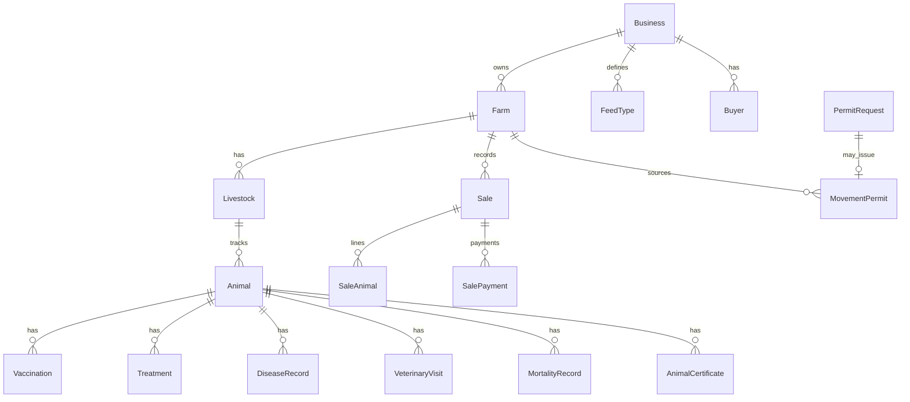

# Farmer Workspace — Modules, Fields & Navigation

Reference for the **Farmer** tenant workspace in DayareMeat (BuchaPro). Generated from routes, models, migrations, and form validation in the codebase.

---

## Overview

| Item | Detail |
|------|--------|
| **URL prefix** | `/farmer/*` |
| **Route name prefix** | `farmer.*` |
| **Middleware** | `auth`, `verified`, `tenant`, `workspace:farmer`, `tenant.permission` |
| **Tenant type** | `Business::TYPE_FARMER` on the farmer’s business record |
| **Data scope** | All records tied to businesses returned by `User::accessibleFarmerBusinessIds()` (owned + member farmer businesses) |
| **Permission model** | Farmer routes are **excluded** from processor RBAC (`EnsureTenantPermission` skips `farmer.*`). Access is enforced by policies and “accessible business/farm” checks in controllers. |
| **Hierarchy** | **Business (farmer)** → **Farm** → **Livestock (herd/group)** → **Animal (individual)** |

### Sidebar navigation (UI)

| Nav item | Route | Notes |
|----------|-------|--------|
| Dashboard | `farmer.dashboard` | Cross-module KPIs and alerts |
| Farms | `farmer.farms.*` | Farm registration & management |
| Livestock | `farmer.livestock.index` | Hub across farms |
| Animals | `farmer.animals.index` | Hub across herds |
| Health | `farmer.health.*` | Vaccinations, treatments, diseases, vet visits, mortalities, timeline |
| Feeding | `farmer.feeding.*` | Feed types, inventory, records, suppliers, schedules |
| Certificates | `farmer.certificates.*` | Animal certificates, templates, ownership transfers, logs |
| Movement | `farmer.movement.*` | Permit requests, permits, history, animals, logs |
| Sales | `farmer.sales.*` | Buyers, sales, payments, documents, logs |
| System Settings | `settings.edit` | Shared settings (species/units, etc.) |

**Redirects (legacy):** `farmer.supply-requests.*` and `farmer.supply-history` → dashboard.

**Top-level health certificates:** `farmer.health-certificates.*` (farm-level batch certificates, separate from animal certificates module).

---

## 1. Dashboard

**Route:** `GET /farmer/dashboard` → `FarmerDashboardController`  
**Service:** `App\Services\Farmer\FarmerDashboardService`

Aggregates KPIs from health, feeding, sales, movement, and certificate analytics. Examples:

- Active / sold / quarantined / healthy animals  
- Vaccinations due today  
- Certificates expiring soon / expired  
- Pending veterinary approvals on movement permits  
- Feed inventory expiring soon  
- Sales and movement summaries (via dedicated analytics services)

---

## 2. Farms

**Routes:** `farmer.farms` (resource)  
**Table:** `farms`  
**Model:** `App\Models\Farm`

### Purpose

Register and manage physical farm sites under a farmer business. Creating a farm also updates the linked **Business** owner/profile fields (registration wizard).

### Fields

| Field | Type | Required (create) | Notes |
|-------|------|-------------------|--------|
| `business_id` | FK → `businesses` | Yes | Must be in user’s accessible farmer businesses |
| `name` | string | Yes | Farm name |
| `registration_number` | string | Yes | Farm RDB / registration ID |
| `country_id` | FK → `administrative_divisions` | No | Rwanda admin hierarchy |
| `province_id` | FK | No | |
| `district_id` | FK | No | |
| `sector_id` | FK | No | |
| `cell_id` | FK | No | |
| `village_id` | FK | No | |
| `gps_latitude` | decimal(10,7) | No | -90 to 90 |
| `gps_longitude` | decimal(10,7) | No | -180 to 180 |
| `farm_size_hectares` | decimal | Yes | ≥ 0 |
| `land_ownership_type` | string | Yes | `owned`, `leased`, `communal`, `government`, `other` |
| `registration_date` | date | Yes | ≤ today |
| `animal_types` | JSON array | No | Subset of: `cattle`, `goat`, `pig`, `poultry` (`FarmerAnimalType`) |
| `status` | string | Yes | `active`, `inactive`, `suspended` |

### Business fields (on farm create/update — same form)

| Field | Notes |
|-------|--------|
| `owner_first_name`, `owner_last_name` | Required |
| `owner_national_id` | Required |
| `contact_phone`, `email` | Required |
| `owner_emergency_contact` | Required |
| `ownership_type` | `sole_proprietor`, `cooperative`, `company` |
| `organization_name` | Required if cooperative/company |
| `tax_id` | Required if cooperative/company |
| `owner_dob`, `owner_gender` | Required |
| `members[]` | Required for cooperative/company: `first_name`, `last_name`, `date_of_birth`, `phone`, `gender` |

### Related routes (nested under farm)

| Route | Purpose |
|-------|---------|
| `farmer.farms.livestock.*` | Livestock groups on this farm |
| `farmer.farms.livestock.animals.*` | Individual animals in a herd |
| `farmer.farms.livestock.move` | Move animals between livestock groups |
| `farmer.farms.livestock-health-splits.update` | Health split configuration |
| `farmer.farms.health-records.*` | Legacy/simple farm-level health records |

---

## 3. Livestock (herds / groups)

**Routes:** `farmer.farms.livestock.*`, hubs `farmer.livestock.index`  
**Table:** `livestock` (+ `livestock_details`)  
**Model:** `App\Models\Livestock`

### Fields — `livestock`

| Field | Type | Notes |
|-------|------|--------|
| `farm_id` | FK → `farms` | |
| `type` | string | Animal type: `cattle`, `goat`, `pig`, `poultry` |
| `breed` | string | Part of unique key with farm + type |
| `total_quantity` | unsigned int | Head count |
| `available_quantity` | unsigned int | Available for sale/movement |
| `feeding_type` | string | e.g. `organic`, `pasture`, `mixed`, `concentrate` |
| `base_price` | decimal | Optional pricing reference |
| `health_status` | string | `healthy`, `under_observation`, `sick` |
| `deleted_at` | soft delete | |

**Unique:** `(farm_id, type, breed)`

### Fields — `livestock_details` (1:1)

| Field | Type |
|-------|------|
| `livestock_id` | FK |
| `age_range` | string |
| `weight_range` | string |
| `notes` | text |

### Livestock events

**Table:** `livestock_events` — audit/history of herd-level events (see `LivestockEvent` model).

---

## 4. Animals (individual tracking)

**Routes:** `farmer.farms.{farm}.livestock.{livestock}.animals.*`, hub `farmer.animals.index`  
**Table:** `animals`  
**Model:** `App\Models\Animal`

### Fields

| Field | Type | Required | Notes |
|-------|------|----------|--------|
| `livestock_id` | FK | Yes | Parent herd |
| `animal_code` | string | Auto | Unique per livestock |
| `tag_number` | string | Yes | Unique per livestock |
| `qr_code` | string | No | |
| `public_verification_token` | string | No | Public verify URL |
| `animal_name` | string | No | |
| `gender` | string | Yes | `male`, `female`, `unknown` |
| `birth_date` | date | No | ≤ today |
| `age` | decimal | No | |
| `weight` | decimal | No | kg |
| `color_markings` | string | No | |
| `acquisition_type` | string | No | Validated set on model |
| `acquisition_date` | date | No | |
| `source` | string | No | |
| `mother_tag`, `father_tag` | string | No | |
| `health_status` | string | Yes | `healthy`, `sick`, `injured`, `pregnant`, `under_treatment`, `quarantined` |
| `production_status` | string | No | `growing`, `lactating`, `breeding`, `ready_for_sale`, `dry` |
| `lifecycle_status` | string | Yes | `active`, `sold`, `dead`, `transferred` |
| `current_condition` | string | No | Enum or legacy free text |
| `photo_path` | string | No | Upload `photo` (max 4MB) |
| `notes` | text | No | |
| `created_by` | FK → users | No | |
| `deleted_at` | soft delete | | |

---

## 5. Health module

**Prefix:** `/farmer/health` → `farmer.health.*`  
**Hub:** `farmer.health.hub`

All animal-level health records require an **animal** (`animal_id`). The **timeline** (`farmer.health.timeline.index`) merges events across modules.

### 5.1 Vaccinations

**Table:** `vaccinations` | **Routes:** `farmer.health.vaccinations.*`

| Field | Notes |
|-------|--------|
| `animal_id` | FK |
| `vaccination_code` | Unique |
| `vaccine_name` | |
| `vaccine_type`, `manufacturer`, `batch_number` | Optional |
| `dosage`, `administration_method` | |
| `vaccination_date` | |
| `next_due_date` | |
| `veterinarian_name`, `veterinary_clinic`, `administered_by` | |
| `status` | e.g. `scheduled`, `completed` |
| `side_effects`, `reaction_notes`, `notes` | |
| `attachment_path` | |

### 5.2 Treatments

**Table:** `treatments` | **Routes:** `farmer.health.treatments.*`

| Field | Notes |
|-------|--------|
| `animal_id` | FK |
| `treatment_code` | Unique |
| `disease_name`, `symptoms`, `diagnosis` | |
| `medicine_name`, `dosage`, `treatment_method` | |
| `treatment_start_date`, `treatment_end_date` | |
| `veterinarian_name`, `response_to_treatment` | |
| `follow_up_date` | |
| `status` | Default `ongoing` |
| `notes`, `attachment_path` | |

### 5.3 Disease records

**Table:** `disease_records` | **Routes:** `farmer.health.diseases.*`

| Field | Notes |
|-------|--------|
| `animal_id` | FK |
| `disease_code` | Unique |
| `disease_name` | |
| `symptoms` | |
| `severity_level` | Default `medium` |
| `diagnosis_date` | |
| `quarantine_required` | boolean |
| `contagious_status` | Default `unknown` |
| `recovery_status` | Default `recovering` |
| `veterinarian_name`, `notes`, `attachment_path` | |

### 5.4 Veterinary visits

**Table:** `veterinary_visits` | **Routes:** `farmer.health.vet-visits.*`

| Field | Notes |
|-------|--------|
| `animal_id` | FK |
| `visit_code` | Unique |
| `visit_date` | |
| `veterinarian_name`, `clinic_name` | |
| `purpose_of_visit` | |
| `findings`, `recommendations` | |
| `follow_up_required`, `follow_up_date` | |
| `attachment_path`, `notes` | |

### 5.5 Mortality records

**Table:** `mortality_records` | **Routes:** `farmer.health.mortalities.*`

| Field | Notes |
|-------|--------|
| `animal_id` | FK |
| `mortality_code` | Unique |
| `death_date` | |
| `cause_of_death` | |
| `reported_by` | |
| `postmortem_done` | boolean |
| `veterinarian_name`, `disposal_method` | |
| `notes`, `attachment_path` | |

### 5.6 Farm-level health records (legacy/simple)

**Table:** `animal_health_records` | **Routes:** `farmer.farms.health-records.*`

| Field | Notes |
|-------|--------|
| `farm_id` | FK |
| `livestock_id` | Optional FK |
| `record_date` | |
| `condition` | Short status label |
| `notes` | |

### 5.7 Farmer health certificates (batch / farm)

**Table:** `farmer_health_certificates` | **Routes:** `farmer.health-certificates.*`

| Field | Notes |
|-------|--------|
| `certificate_number` | Unique |
| `farmer_id` | FK → businesses |
| `farm_id` | FK |
| `livestock_id` | Optional |
| `batch_reference` | Optional |
| `source_health_record_id` | Optional FK |
| `certificate_type` | |
| `issued_by` | |
| `issue_date`, `expiry_date` | |
| `status` | Default `valid` |
| `file_path` | Uploaded document |
| `notes` | |

---

## 6. Feeding module

**Prefix:** `/farmer/feeding` → `farmer.feeding.*`  
**Scoped by:** `business_id` (farmer business)

### 6.1 Feed types

**Table:** `feed_types` | **Routes:** `farmer.feeding.feed-types.*`

| Field | Notes |
|-------|--------|
| `business_id` | FK |
| `feed_name`, `feed_code` | Unique per business |
| `feed_category`, `feed_form` | |
| `unit` | Default `kg` |
| `protein_percentage`, `energy_value` | |
| `nutritional_value`, `manufacturer`, `description` | |
| `status` | Default `active` |

### 6.2 Feed suppliers

**Table:** `feed_suppliers` | **Routes:** `farmer.feeding.suppliers.*` (index, create, store, show)

| Field | Notes |
|-------|--------|
| `business_id` | FK |
| `supplier_name`, `supplier_code` | Unique per business |
| `contact_person`, `phone`, `email`, `address` | |
| `supplied_feed_types` | JSON |
| `status`, `notes` | |

### 6.3 Feed inventory

**Table:** `feed_inventories` | **Routes:** `farmer.feeding.inventory.*`

| Field | Notes |
|-------|--------|
| `feed_type_id` | FK |
| `inventory_code` | Unique |
| `supplier_id` | Optional FK |
| `quantity_received`, `quantity_remaining` | |
| `unit_cost`, `total_cost` | |
| `purchase_date`, `expiry_date` | |
| `storage_location`, `reorder_level`, `batch_number` | |
| `status` | Default `available` |
| `notes` | |

**Child:** `feed_inventory_movements` — stock adjustments linked to feeding records.

### 6.4 Feeding records

**Table:** `feeding_records` | **Routes:** `farmer.feeding.records.*`

| Field | Notes |
|-------|--------|
| `feeding_code` | Unique |
| `animal_id` | Optional (individual) |
| `livestock_id` | Optional (group) |
| `feed_type_id`, `feed_inventory_id` | FK |
| `quantity` | |
| `feeding_method`, `feeding_time`, `feeding_date` | |
| `fed_by` | |
| `appetite_status`, `water_provided`, `feeding_response` | |
| `notes` | |

### 6.5 Feeding schedules

**Table:** `feeding_schedules` | **Routes:** `farmer.feeding.schedules.*` (index, create, store)

| Field | Notes |
|-------|--------|
| `business_id` | FK |
| `schedule_name` | |
| `animal_id` or `livestock_id` | Target |
| `feed_type_id` | FK |
| `feeding_time`, `feeding_frequency` | |
| `quantity`, `instructions` | |
| `status` | Default `active` |

---

## 7. Certificates module (animal)

**Prefix:** `/farmer/certificates` → `farmer.certificates.*`

### 7.1 Animal certificate templates

**Table:** `animal_certificate_templates` | **Routes:** `farmer.certificates.templates.*`

| Field | Notes |
|-------|--------|
| `business_id` | FK |
| `template_name` | |
| `certificate_type` | |
| `title_template`, `header_note`, `footer_note` | |
| `watermark_text` | |
| `is_default` | boolean |
| `status` | Default `active` |

### 7.2 Animal certificates

**Table:** `animal_certificates` | **Routes:** `farmer.certificates.animal-certificates.*`

| Field | Notes |
|-------|--------|
| `animal_id` | FK |
| `template_id` | Optional |
| `certificate_number` | Unique |
| `certificate_type` | `ownership`, `health`, `traceability`, `transfer` |
| `certificate_title` | |
| `issue_date`, `expiry_date` | |
| `issued_by`, `veterinarian_name` | |
| `verification_token`, `qr_code`, `digital_signature` | |
| `certificate_status` | `draft`, `active`, `expired`, `revoked` |
| `remarks`, `pdf_path` | |

**Actions:** revoke, download PDF, QR.

### 7.3 Ownership transfers

**Table:** `animal_ownership_transfers` | **Routes:** `farmer.certificates.ownership-transfers.*`

| Field | Notes |
|-------|--------|
| `animal_id` | FK |
| `previous_owner`, `new_owner` | |
| `transfer_date`, `transfer_reason` | |
| `approved_by`, `notes` | |

### 7.4 Certificate audit logs

**Table:** `animal_certificate_logs` | **Route:** `farmer.certificates.logs.index`

| Field | Notes |
|-------|--------|
| `animal_certificate_id` | FK |
| `action_type`, `action_by`, `action_date` | |
| `ip_address`, `notes` | |

---

## 8. Movement module

**Prefix:** `/farmer/movement` → `farmer.movement.*`  
**Legacy aliases:** `farmer.movement-permits.*` redirect to `movement/permits`

### 8.1 Permit requests (workflow)

**Table:** `permit_requests` (+ `permit_request_animals`) | **Routes:** `farmer.movement.requests.*`

**Permit request fields:**

| Field | Notes |
|-------|--------|
| `request_number` | Unique |
| `request_date` | |
| `applicant_id` | FK → users |
| `farm_id`, `farmer_id` | FK |
| `movement_purpose` | `sale`, `breeding`, `slaughter`, `vaccination`, `exhibition`, `transfer` |
| `destination_type` | `farm`, `market`, `abattoir`, `border`, `cooperative` |
| `destination_name` | |
| `destination_district/sector/cell/village` | Text admin fields |
| `transport_method` | `vehicle`, `walking`, `motorcycle`, etc. |
| `vehicle_plate_number` | |
| `proposed_departure_date`, `expected_arrival_date` | |
| `remarks` | |
| `status` | Default `draft` |
| `reviewed_by`, `review_date`, `rejection_reason` | |

**Permit request animal line:**

| Field | Notes |
|-------|--------|
| `permit_request_id`, `animal_id`, `livestock_id` | |
| `animal_identifier`, `quantity` | |
| `eligibility_passed`, `eligibility_issues` (JSON) | |

**Workflow actions:** submit, approve, reject, issue-permit.

### 8.2 Movement permits

**Table:** `movement_permits` (+ related tables) | **Routes:** `farmer.movement.permits.*`

**Core fields:**

| Field | Notes |
|-------|--------|
| `permit_request_id` | Optional link from request |
| `permit_number` | Unique |
| `permit_type` | `farm_transfer`, `market_transport`, `slaughter_transport`, `veterinary_referral`, `breeding_transfer`, `quarantine_movement` |
| `movement_reason`, `livestock_type` | |
| `farmer_id` | FK → businesses |
| `source_farm_id` | FK → farms |
| `origin_location` | |
| `source_district/sector/cell/village` | Text |
| `destination_location` | |
| `destination_district_id` … `destination_village_id` | FK (legacy) + text fields |
| `destination_district/sector/cell/village` | Text |
| `departure_date`, `expected_arrival_date` | |
| `issue_date`, `expiry_date` | |
| `transport_mode`, `vehicle_plate` | |
| `driver_name`, `driver_phone`, `transporter_name` | |
| `issued_by`, `issuing_authority` | |
| `permit_status` | `draft`, `pending_approval`, `approved`, `issued`, `active`, `used`, `rejected`, `expired`, `cancelled`, `revoked` |
| `veterinary_status` | `pending_inspection`, `cleared`, `rejected` |
| `movement_status` | `pending`, `in_transit`, `arrived`, etc. |
| `qr_code`, `qr_code_path`, `verification_token`, `verification_code` | |
| `approved_by`, `notes` | |
| `attachment_path`, `pdf_path`, `file_path` | |
| `created_by` | |

**Permit animals** (`movement_permit_animals`): species/type, quantity, `animal_id`, `movement_condition`, `inspection_notes`, `loading_status`, `arrival_status`.

**Related tables:**

- `movement_transports` — vehicle, driver, route, departure/arrival times  
- `movement_veterinary_approvals` — vet inspection & clearance  
- `movement_logs` — audit trail  

**Actions:** submit, approve, reject, start-transit, confirm-arrival, cancel, download PDF, **import from PDF**.

### 8.3 Movement history

**Table:** `movement_histories` | **Routes:** `farmer.movement.history.*`

Per-animal movement audit: `animal_id`, `movement_permit_id`, `movement_date`, source/destination, purpose, transport, `status`, `remarks`.

### 8.4 Movement hub utilities

| Route | Purpose |
|-------|---------|
| `farmer.movement.animals.index` | Animals eligible for movement |
| `farmer.movement.logs.index` | Movement permit action logs |
| `farmer.movement.verification` | Redirect to public permit lookup |

---

## 9. Sales module

**Prefix:** `/farmer/sales` → `farmer.sales.*`  
**Scoped by:** `farm_id` / `business_id` on buyers

### 9.1 Buyers

**Table:** `buyers` | **Routes:** `farmer.sales.buyers.*`

| Field | Notes |
|-------|--------|
| `business_id` | FK |
| `buyer_code` | Unique per business |
| `buyer_name`, `buyer_type` | |
| `contact_person`, `phone`, `email` | |
| `national_id`, `company_registration` | |
| `country`, `province`, `district`, `address` | |
| `preferred_payment_method` | |
| `trust_level` | Default `new_buyer` |
| `status` | Default `active` |
| `notes` | |

### 9.2 Sales (records)

**Table:** `sales` | **Routes:** `farmer.sales.records.*`

| Field | Notes |
|-------|--------|
| `farm_id` | FK |
| `sale_number` | Unique |
| `buyer_id` | FK |
| `sale_type` | `individual_animal_sale`, `livestock_group_sale`, `market_sale`, `slaughter_sale`, `breeding_sale`, `export_sale` |
| `sale_date` | |
| `sale_status` | `draft`, `pending`, `confirmed`, `completed`, `cancelled`, `refunded` |
| `payment_status` | `pending`, `partial`, `paid`, `overdue`, `refunded` |
| `payment_method` | |
| `subtotal_amount`, `discount_amount`, `tax_amount`, `total_amount` | |
| `currency` | Default `RWF` |
| `delivery_method`, `destination` | |
| `movement_permit_id` | Optional FK |
| `certificate_status` | Default `unverified` |
| `approved_by`, `notes`, `attachment_path` | |

**Workflow:** confirm, approve, complete, cancel.

### 9.3 Sale animals (lines)

**Table:** `sale_animals`

| Field | Notes |
|-------|--------|
| `sale_id` | FK |
| `animal_id` or `livestock_id` | |
| `sale_price`, `live_weight`, `price_per_kg` | |
| `animal_condition` | Default `healthy` |
| `certificate_verified`, `movement_permit_verified` | booleans |
| `remarks` | |

### 9.4 Sale payments

**Table:** `sale_payments` | **Routes:** `farmer.sales.payments.*`

| Field | Notes |
|-------|--------|
| `sale_id` | FK |
| `payment_reference` | Unique per sale |
| `payment_date`, `payment_method` | |
| `amount_paid`, `remaining_balance` | |
| `transaction_reference` | |
| `payment_status` | Default `paid` |
| `received_by`, `notes` | |

### 9.5 Sale documents

**Table:** `sale_documents` | **Routes:** `farmer.sales.documents.*`

| Field | Notes |
|-------|--------|
| `sale_id` | FK |
| `document_type`, `document_number` | |
| `generated_by`, `document_path`, `generated_at` | |
| `notes` | |

### 9.6 Sale logs

**Table:** `sale_logs` | **Route:** `farmer.sales.logs.index` — audit of sale status changes.

### 9.7 Sales hub extras

| Route | Purpose |
|-------|---------|
| `farmer.sales.animals.index` | Animals available for sale |
| `farmer.sales.hub` | Module landing |

---

## 10. Entity relationship (simplified)

---

## 11. Key code locations

| Area | Path |
|------|------|
| Routes | `routes/web.php` (farmer group ~L322–422) |
| Sidebar | `resources/views/layouts/sidebar.blade.php` (farmer nav ~L90–102) |
| Controllers | `app/Http/Controllers/Farmer/` |
| Form requests | `app/Http/Requests/Farmer/` |
| Services | `app/Services/Farmer/` |
| Models | `app/Models/` (Farm, Livestock, Animal, Sale, MovementPermit, etc.) |
| Views | `resources/views/farmer/` |
| Animal types | `app/Support/FarmerAnimalType.php` |

---

## 12. Notes & gaps

1. **No farmer RBAC roles** — Unlike the processor workspace, farmers do not use `BusinessUser` role permissions; any user with access to the farmer business sees all farmer modules (subject to farm/business ownership policies).  
2. **Supply requests** — UI routes redirect to dashboard; processor intake linkage exists on `animal_intakes` (`farmer` context migration) but is not a full farmer module in the sidebar.  
3. **Settings** — Farmer workspace shares global `settings.edit` with processor (species, units, cold-room standards when applicable).  
4. **PDF import** — Movement permits support Rwanda permit PDF import (`farmer.movement.permits.import-pdf`).  
5. **Public verification** — Movement permits and animal certificates expose verification tokens/QR for external lookup.

---

*Last updated from codebase analysis. For API/mobile farmer endpoints, see `docs/MOBILE_API_DOCUMENTATION.md`.*
