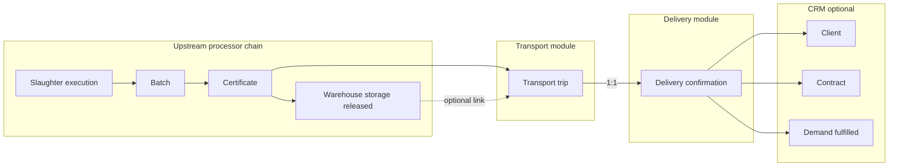

# Processor Workspace — Transport & Delivery Confirmation

Reference for **Transport trips** and **Delivery confirmations** in the DayareMeat (BuchaPro) **processor** workspace. Generated from routes, controllers, models, migrations, validation, and Blade views.

---

## Overview

| Item | Detail |
|------|--------|
| **Workspace** | Processor (`workspace:processor`) |
| **Middleware** | `auth`, `tenant`, `workspace:processor`, `tenant.permission` |
| **Data scope** | Records reachable through the user’s **accessible processor businesses** → **facilities** → slaughter chain → **certificates** → **transport trips** → **delivery confirmations** |
| **Core idea** | Certified product leaves a facility on a **transport trip**; when it arrives, a **delivery confirmation** records who received it, how much, and the outcome status. |

### Sidebar navigation

| Nav item | Route | Permission (sidebar) | Notes |
|----------|-------|----------------------|--------|
| Transport | `transport-trips.hub` | `create_transport_trip` (or `view_all_modules`) | Hub + list + CRUD |
| Delivery confirmation | `delivery-confirmations.index` | `confirm_delivery` (or `view_all_modules`) | List + CRUD (no separate hub) |
| Demand | `demands.index` | `view_all_modules` | Links deliveries to customer demand fulfillment |

**Related modules (workflow):** Certificates → Cold room / warehouse storage (optional release) → Transport → Delivery confirmation → Demand fulfillment.

---

## End-to-end workflow



### Typical operator sequence

1. **Issue or access a certificate** for product that may leave the plant (`certificates.*`).
2. **(Optional)** Store batch in cold room and **release** warehouse storage when stock is ready to move (`warehouse-storages`, status `released`).
3. **Record transport trip** — certificate, origin/destination facilities, vehicle/driver, dates, trip status.
4. **Confirm delivery** — pick the trip (only trips **without** an existing confirmation on create), receiving location, quantity, receiver, status.
5. **(Optional)** On **Demand** edit, link `fulfilled_by_delivery_id` to mark a customer demand as fulfilled when client/facility matches.

---

## Data scope & authorization

Neither module uses Laravel policies on the model; access is enforced in controllers by **scoping IDs** to the current user’s processor footprint.

### Scope chain (both controllers)

```
User::accessibleBusinessIds()
  → Facility (business_id in set)
  → SlaughterPlan (facility_id)
  → SlaughterExecution (slaughter_plan_id)
  → Batch (slaughter_execution_id)
  → Certificate (batch_id OR facility_id when batch_id null)
  → TransportTrip (certificate_id)
  → DeliveryConfirmation (transport_trip_id)
```

**Facility checks:** Origin, destination, and receiving facilities must belong to `accessibleBusinessIds()` when set.

**Certificate rule:** A certificate counts if it is tied to an in-scope batch **or** has no batch but its `facility_id` is in-scope (facility-issued certificates).

**Client rule (delivery):** `client_id` must belong to an active `Client` on an accessible business.

**Business owner bypass:** `User::ownsBusiness()` grants all processor permissions for that business, including transport and delivery.

### HTTP 404 vs 403

- Wrong tenant / out-of-scope IDs → **404** (not found).
- Missing RBAC permission → **403** from `EnsureTenantPermission`.

---

## 1. Transport trips

**Controller:** `App\Http\Controllers\TransportTripController`  
**Model:** `App\Models\TransportTrip`  
**Table:** `transport_trips`

### Routes

| Method | URI | Name | Action |
|--------|-----|------|--------|
| GET | `/transport-trips/overview` | `transport-trips.hub` | Hub KPIs + shortcuts |
| GET | `/transport-trips` | `transport-trips.index` | Paginated list |
| GET | `/transport-trips/create` | `transport-trips.create` | Form |
| POST | `/transport-trips` | `transport-trips.store` | Create |
| GET | `/transport-trips/{transport_trip}` | `transport-trips.show` | Detail + delivery link |
| GET | `/transport-trips/{id}/edit` | `transport-trips.edit` | Form |
| PUT/PATCH | `/transport-trips/{id}` | `transport-trips.update` | Update |
| DELETE | `/transport-trips/{id}` | `transport-trips.destroy` | Delete |

### Hub KPIs

| Metric | Source |
|--------|--------|
| Total trips | All in-scope trips |
| Pending / In transit / Arrived / Completed | Count by `status` |
| With delivery confirmation | `has('deliveryConfirmation')` |

Hub also links to: all trips, certificates hub, cold room hub, delivery confirmations index.

### Fields — `transport_trips`

| Field | Type | Required | Validation / notes |
|-------|------|----------|-------------------|
| `certificate_id` | FK → `certificates` | Yes | Must be in user’s certificate scope |
| `warehouse_storage_id` | FK → `warehouse_storages`, nullable | No | If set: same certificate scope; storage **`status` must be `released`** |
| `batch_id` | FK → `batches`, nullable | No | Optional explicit batch |
| `origin_facility_id` | FK → `facilities` | Yes | In-scope facility |
| `destination_facility_id` | FK → `facilities` | Yes | In-scope; **must differ** from origin |
| `vehicle_plate_number` | string(50) | Yes | |
| `driver_name` | string(255) | Yes | |
| `driver_phone` | string(50) | No | |
| `departure_date` | date | Yes | |
| `arrival_date` | date | No | `after_or_equal:departure_date` |
| `status` | string(50) | Yes | See statuses below |

### Trip statuses

| Value | Label (UI) |
|-------|------------|
| `pending` | Pending |
| `in_transit` | In transit |
| `arrived` | Arrived |
| `completed` | Completed |

### Relationships

| Relation | Cardinality | Notes |
|----------|-------------|--------|
| `certificate` | belongsTo | Traceability anchor |
| `warehouseStorage` | belongsTo | Optional cold-room release link |
| `batch` | belongsTo | Optional |
| `originFacility` / `destinationFacility` | belongsTo | Facilities |
| `deliveryConfirmation` | hasOne | **At most one** confirmation per trip |

### Form request classes

- `StoreTransportTripRequest`
- `UpdateTransportTripRequest`

### Views

| View | Purpose |
|------|---------|
| `transport-trips/hub.blade.php` | Module home |
| `transport-trips/index.blade.php` | List + KPIs (total, arrived, completed) |
| `transport-trips/create.blade.php` | Create form |
| `transport-trips/edit.blade.php` | Edit form |
| `transport-trips/show.blade.php` | Detail; links to certificate, batch, storage, delivery confirmation |

### RBAC (`EnsureTenantPermission`)

| Action | Permission |
|--------|------------|
| view (index, show, hub) | `track_delivery_status` |
| create (create, store) | `create_transport_trip` |
| update (edit, update) | `dispatch_delivery` |
| delete (destroy) | `dispatch_delivery` |

**Roles with full transport permissions:** `transport_manager` (create, dispatch, track, confirm, certificates view, temperature logs).  
**Org admin:** `track_delivery_status` only — can **view** trips via `view_all_modules` fallback on view routes; **cannot** create trips unless business owner.  
**Operations manager / inspector / compliance / accountant:** no transport permissions by default.

---

## 2. Delivery confirmations

**Controller:** `App\Http\Controllers\DeliveryConfirmationController`  
**Model:** `App\Models\DeliveryConfirmation`  
**Table:** `delivery_confirmations`

### Routes

| Method | URI | Name | Action |
|--------|-----|------|--------|
| GET | `/delivery-confirmations` | `delivery-confirmations.index` | List (+ optional facility filter) |
| GET | `/delivery-confirmations/create` | `delivery-confirmations.create` | Form |
| POST | `/delivery-confirmations` | `delivery-confirmations.store` | Create |
| GET | `/delivery-confirmations/{id}` | `delivery-confirmations.show` | Detail |
| GET | `/delivery-confirmations/{id}/edit` | `delivery-confirmations.edit` | Form |
| PUT/PATCH | `/delivery-confirmations/{id}` | `delivery-confirmations.update` | Update |
| DELETE | `/delivery-confirmations/{id}` | `delivery-confirmations.destroy` | Delete |

### Fields — `delivery_confirmations`

| Field | Type | Required | Validation / notes |
|-------|------|----------|-------------------|
| `transport_trip_id` | FK → `transport_trips` | Yes | **Unique** — one confirmation per trip; create form only lists trips **without** confirmation |
| `receiving_facility_id` | FK → `facilities`, nullable | No | In-scope when set; **null = external / non-registered recipient** |
| `client_id` | FK → `clients`, nullable | No | Active client on accessible business |
| `contract_id` | FK → `contracts`, nullable | No | Validated in API; **not exposed on web create/edit forms** (see gaps) |
| `received_quantity` | unsigned int | Yes | min 0 |
| `received_date` | date | Yes | |
| `receiver_name` | string(255) | Yes | |
| `receiver_country` | string(100) | No | External deliveries |
| `receiver_address` | text | No | External deliveries |
| `confirmation_status` | string(50) | Yes | `pending`, `confirmed`, `disputed` |

### Confirmation statuses

| Value | Meaning |
|-------|---------|
| `pending` | Recorded, not finalized |
| `confirmed` | Receiver acknowledged |
| `disputed` | Quantity/issue dispute |

### External recipient UX

- Receiving facility dropdown includes **“External / non-registered”** (empty value).
- When external, **client** block is shown; selecting a client prefills `receiver_name`, `receiver_country`, `receiver_address` via JavaScript.
- Model helper: `isExternalRecipient()` → `receiving_facility_id === null`.
- Accessor: `receiver_display` — facility name, else client display name, else name + country.

### Relationships

| Relation | Cardinality | Notes |
|----------|-------------|--------|
| `transportTrip` | belongsTo | Parent trip |
| `receivingFacility` | belongsTo | Nullable |
| `client` | belongsTo | CRM customer |
| `contract` | belongsTo | Customer contract (optional) |
| `fulfillingDemand` | hasOne | `Demand.fulfilled_by_delivery_id` |

### Index features

- Pagination (10 per page).
- Query filter: `?receiving_facility_id=` (in-scope facilities only).
- KPIs: total confirmations, count with status `confirmed`.

### Form request classes

- `StoreDeliveryConfirmationRequest`
- `UpdateDeliveryConfirmationRequest`

### Views

| View | Purpose |
|------|---------|
| `delivery-confirmations/index.blade.php` | List |
| `delivery-confirmations/create.blade.php` | Create (trip picker, external/client JS) |
| `delivery-confirmations/edit.blade.php` | Edit (all in-scope trips; can change trip) |
| `delivery-confirmations/show.blade.php` | Detail + links to trip, client, contract, demand |

### RBAC

| Action | Permission |
|--------|------------|
| view | `track_delivery_status` |
| create | `confirm_delivery` |
| update | `confirm_delivery` |
| delete | `confirm_delivery` |

**Transport manager** has `confirm_delivery`. **Org admin** can view via `view_all_modules` on view routes but cannot create confirmations without `confirm_delivery` or ownership.

---

## 3. Integration with Demand (CRM)

**Module:** `demands.*` — `App\Http\Controllers\DemandController`

When editing a demand that has `client_id` or `destination_facility_id`, the form loads **candidate deliveries**: confirmations whose `client_id` or `receiving_facility_id` matches the demand.

On update, if `fulfilled_by_delivery_id` is set and matches an in-scope delivery aligned with the demand’s client/facility:

- Demand `status` → `fulfilled`
- `demands.fulfilled_by_delivery_id` → delivery id

Show view on delivery confirmation displays linked demand when present.

---

## 4. Integration with Certificates & Cold room

| Step | Module | Rule |
|------|--------|------|
| Certificate required | `certificates` | Every trip must reference a certificate the user can access |
| Optional storage | `warehouse-storages` | Trip may link `warehouse_storage_id` only if storage is **released** |
| Trip show page | `transport-trips.show` | Links to certificate, batch, warehouse storage, delivery confirmation |

Cold room hub is linked from transport hub as a prerequisite reminder (“release storage before linking a trip”).

---

## 5. Mobile API (processor collection)

**Controller:** `App\Http\Controllers\Api\MobileCollectionController`  
**Routes:** `routes/api.php` (authenticated mobile collection group)

| Endpoint | Request | Notes |
|----------|---------|--------|
| `POST transport-trips` | `StoreTransportTripRequest` | Same validation and scope as web |
| `POST delivery-confirmations` | `StoreDeliveryConfirmationRequest` | Also validates `contract_id` against accessible business |

Swagger schemas: `DeliveryConfirmation`, `DeliveryConfirmationCreateRequest`.

---

## 6. Database migrations (evolution)

| Migration | Change |
|-----------|--------|
| `2025_03_01_120001_create_transport_trips_table` | Core trip table |
| `2025_03_01_140000_create_delivery_confirmations_table` | Core confirmation; `receiving_facility_id` required initially |
| `2025_03_01_180002_add_warehouse_storage_id_to_transport_trips_table` | Cold-room link |
| `2026_03_06_125443_allow_external_recipient_on_delivery_confirmations` | Nullable receiving facility; `receiver_country`, `receiver_address` |
| `2026_03_06_130051_add_client_id_to_delivery_confirmations_table` | CRM client link |
| `2026_03_16_120000_add_contract_client_id_and_delivery_contract_id` | `contract_id` on deliveries |

---

## 7. Role permission summary

| Role | Transport create | Transport edit/delete | Delivery view | Delivery create/edit/delete |
|------|------------------|----------------------|---------------|------------------------------|
| Business owner | Yes (all perms) | Yes | Yes | Yes |
| `transport_manager` | Yes | Yes | Yes | Yes |
| `org_admin` | No* | No* | Yes† | No* |
| `operations_manager` | No | No | No† | No |
| `inspector` | No | No | No† | No |
| `compliance_officer` | No | No | No† | No |
| `accountant` | No | No | No† | No |

\*Unless user **owns** the active processor business.  
†View may work via `view_all_modules` on index/show; sidebar still requires specific permission or `view_all_modules`.

### Permission constants (`BusinessUser`)

| Constant | Slug |
|----------|------|
| `PERMISSION_CREATE_TRANSPORT_TRIP` | `create_transport_trip` |
| `PERMISSION_ASSIGN_VEHICLE_DRIVER` | `assign_vehicle_driver` |
| `PERMISSION_DISPATCH_DELIVERY` | `dispatch_delivery` |
| `PERMISSION_TRACK_DELIVERY_STATUS` | `track_delivery_status` |
| `PERMISSION_CONFIRM_DELIVERY` | `confirm_delivery` |

---

## 8. Key files (quick reference)

| Area | Path |
|------|------|
| Transport controller | `app/Http/Controllers/TransportTripController.php` |
| Delivery controller | `app/Http/Controllers/DeliveryConfirmationController.php` |
| Models | `app/Models/TransportTrip.php`, `app/Models/DeliveryConfirmation.php` |
| Requests | `app/Http/Requests/Store*TransportTrip*`, `Update*`, `Store*DeliveryConfirmation*`, `Update*` |
| Views | `resources/views/transport-trips/*`, `resources/views/delivery-confirmations/*` |
| Routes | `routes/web.php` (processor group ~504–506) |
| RBAC map | `app/Http/Middleware/EnsureTenantPermission.php` |
| Sidebar | `resources/views/layouts/sidebar.blade.php` |
| Demand link | `app/Http/Controllers/DemandController.php` |

---

## 9. Known gaps & product notes

| Topic | Current behavior |
|-------|------------------|
| **Contract on web UI** | `contract_id` is in the model, DB, validation, API, and show page — but **create/edit Blade forms do not include a contract picker**. |
| **One confirmation per trip** | DB unique on `transport_trip_id`; create only offers trips without confirmation. |
| **Quantity unit** | `received_quantity` is a plain integer (no unit field on confirmation). |
| **Trip vs receiving facility** | Trip has `destination_facility_id`; confirmation has separate `receiving_facility_id` (may be external even if trip destination was internal). |
| **Org admin workflow** | Can monitor via list/show if `view_all_modules`; cannot register trips/confirmations without transport manager role or ownership. |
| **Temperature / GPS** | Transport manager has `monitor_temperature_logs`; trips do not store temperature traces (cold room logs are on warehouse storage). |

---

## 10. Testing & seed data

Seeders that build sample trips and confirmations:

- `database/seeders/DeliveryConfirmationSeeder.php`
- `database/seeders/TestProcessorWorkspaceComprehensiveSeeder.php`
- `database/seeders/ComprehensiveRwandaSeeder.php`
- `database/seeders/Support/ProcessorFinanceSync.php` (finance alignment with deliveries)

Use these when validating hub KPIs, external recipient rows, and demand fulfillment links in non-production environments.

---

---

## 11. Export & refactor (2026-05)

| Feature | Routes | Permission |
|---------|--------|------------|
| Transport export | `transport-trips.export` | `export_records` |
| Traceability PDF | `transport-trips.export.traceability` | `export_traceability` |
| Delivery export | `delivery-confirmations.export` | `export_records` |

Formats: `csv`, `excel` (tab-separated `.xls`), `pdf`, `json`. List/hub filters are passed through as query params on export.

**New / updated behaviour:**

- Shared scoping: `App\Http\Controllers\Concerns\ScopesProcessorData`
- Shared export streaming: `App\Http\Controllers\Concerns\ExportsProcessorRecords`
- `received_unit` on `delivery_confirmations` (`App\Enums\ReceivedUnit`)
- Contract picker + `GET delivery-confirmations/contracts?client_id=`
- Optional demand auto-link: `config/processor.php` → `auto_link_demand` (env `PROCESSOR_AUTO_LINK_DEMAND`)
- Deleting a confirmation unlinks `fulfilled_by_delivery_id` and sets demand status to `in_progress`

**Deploy:**

```bash
php artisan migrate
php artisan db:seed --class=ExportPermissionsSeeder
```

*Last aligned with codebase: transport/delivery refactor, migrations through `2026_05_22_140000`, processor routes and sidebar.*
