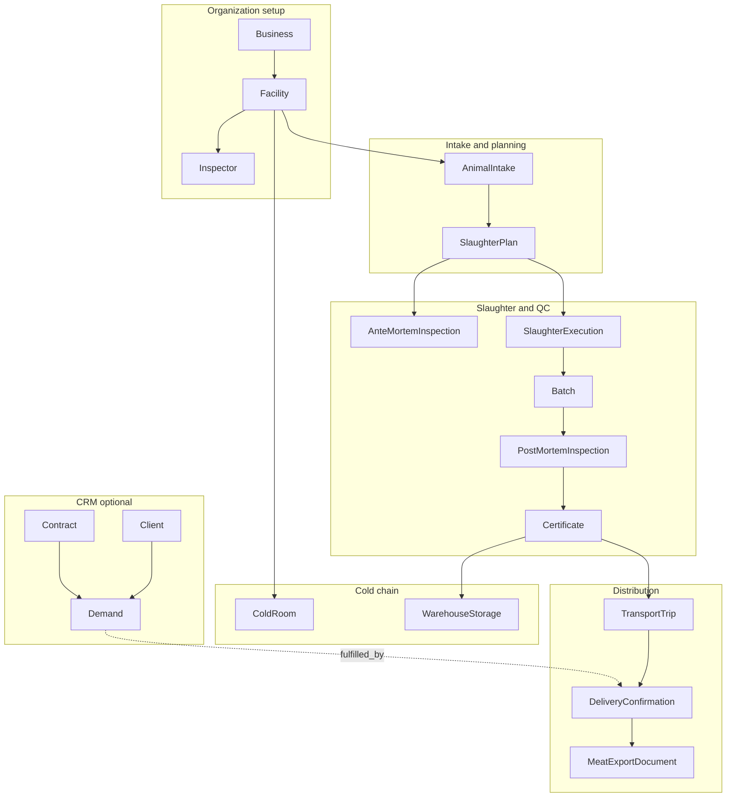

# Processor Workspace — Modules, Navigation & Workflows

Reference for the **Processor** tenant workspace in DayareMeat (BuchaPro). Generated from routes, models, middleware, sidebar configuration, and controllers in the codebase.

---

## Overview

| Item | Detail |
|------|--------|
| **URL prefix** | Root paths (`/dashboard`, `/businesses`, `/animal-intakes`, …) — no `/processor` prefix except business context switcher |
| **Route name prefix** | Mixed (`dashboard`, `businesses.*`, `animal-intakes.*`, `finance.*`, `processor.business-context.*`) |
| **Middleware** | `auth`, `verified` (dashboard only), `tenant`, `workspace:processor`, `tenant.permission` |
| **Tenant type** | `Business::TYPE_PROCESSOR` (`'processor'`) on the processor company record |
| **Facility types** | `Slaughterhouse`, `Butchery`, `storage`, `Other` — operational sites under a processor business |
| **Data scope** | Active processor business → facilities → slaughter chain → certificates → transport → delivery; CRM/finance scoped by `business_id` |
| **Permission model** | Role-based via `business_user` pivot (`BusinessUser::ROLE_PERMISSION_MAP`); business **owners** bypass RBAC |
| **Hierarchy** | **Business (processor)** → **Facility** → **Animal intake** → **Slaughter plan** → **Slaughter execution** → **Batch** → **Certificate** → **Warehouse storage** → **Transport trip** → **Delivery confirmation** |

### Related documentation

| Document | Coverage |
|----------|----------|
| [PROCESSOR_TRANSPORT_DELIVERY.md](./PROCESSOR_TRANSPORT_DELIVERY.md) | Transport trips, delivery confirmations, export documents, demand linkage |
| [DEMAND_MODULE_DESIGN.md](./DEMAND_MODULE_DESIGN.md) | Customer demand module design |
| [CRM_INTEGRATION_PLAN.md](./CRM_INTEGRATION_PLAN.md) | CRM architecture (clients, suppliers, contracts) |
| [SYSTEM_ANALYSIS.md](./SYSTEM_ANALYSIS.md) | Cross-workspace actors and module relationships |
| [MOBILE_API_DOCUMENTATION.md](./MOBILE_API_DOCUMENTATION.md) | Processor mobile collection API |
| [FARMER_WORKSPACE.md](./FARMER_WORKSPACE.md) | Farmer workspace (parallel tenant type) |

### Configuration

File: `config/processor.php`

| Key | Env | Purpose |
|-----|-----|---------|
| `auto_link_demand` | `PROCESSOR_AUTO_LINK_DEMAND` | Auto-link delivery confirmations to open demands |
| `domestic_country` | `PROCESSOR_DOMESTIC_COUNTRY` | Default `RW`; non-domestic deliveries trigger export document requirements |

---

## Access & authorization

### Workspace detection

- `User::tenantWorkspaceType()` returns `'processor'` when the user owns or belongs to a processor business (default if no other workspace applies).
- `EnsureUserWorkspace` (`workspace:processor`) aborts with 403 if workspace type is not processor.

### Active business context

Processors with multiple businesses use a session-scoped active business:

| Item | Detail |
|------|--------|
| Session key | `active_processor_business_id` |
| Switcher UI | Sidebar dropdown (`resources/views/layouts/sidebar.blade.php`) |
| Route | `POST /processor/business-context` → `processor.business-context.update` |
| Controller | `ProcessorBusinessContextController` |

When set, `User::accessibleBusinessIds()` narrows to the active processor business for data scoping.

### Onboarding

- Registration accepts `business_type = processor`.
- Processor users are **not** auto-provisioned with a business; they land on `/dashboard` and create one via **Businesses**.
- Users with **no businesses yet** may access `businesses.*` routes for onboarding (`EnsureTenantPermission::canAccessBusinessOnboardingWithoutActiveContext`).

### Roles

Defined on `App\Models\BusinessUser`:

| Role | Constant | Typical focus |
|------|----------|---------------|
| Org Admin | `org_admin` | Users, roles, finance, exports, compliance visibility |
| Operations Manager | `operations_manager` | Intake, slaughter planning/execution, batches |
| Compliance Officer | `compliance_officer` | Compliance metrics, checklists, temperature, traceability export |
| Inspector | `inspector` | Ante/post-mortem, certificate issuance |
| Transport Manager | `transport_manager` | Transport, delivery, export documents |
| Accountant | `accountant` | Finance dashboard, AR/AP, cost allocations |

**Business owner** (`business.user_id`) has full access regardless of pivot role.

**Finance sidebar** is hidden for most member roles unless the user owns the active business or is org admin (`BusinessUser::showsFinanceSidebarForMembership`).

### Permission enforcement

| Layer | File |
|-------|------|
| Route → permission map | `app/Http/Middleware/EnsureTenantPermission.php` |
| Role → permissions | `app/Models/BusinessUser::ROLE_PERMISSION_MAP` |
| Sidebar filtering | `resources/views/layouts/sidebar.blade.php` |

No Laravel policies exist for processor entities; access is enforced by middleware plus controller ID scoping.

### Data scoping patterns

**Facility chain** (operations modules):

```
User::accessibleBusinessIds()
  → Facility (business_id)
  → SlaughterPlan → SlaughterExecution → Batch → Certificate
  → TransportTrip → DeliveryConfirmation
```

Shared trait: `App\Http\Controllers\Concerns\ScopesProcessorData` (transport, delivery, export documents).

**Business-scoped** (CRM, HR, finance): `whereIn('business_id', accessibleBusinessIds())`.

---

## Sidebar navigation

Source: `resources/views/layouts/sidebar.blade.php` (`$tenantNav`).

### Top level

| Nav item | Route | Permission |
|----------|-------|------------|
| Dashboard | `dashboard` | (none) |

### Operations

| Nav item | Route | Permission |
|----------|-------|------------|
| Businesses | `businesses.hub` | `view_all_modules` |
| Inspectors | `inspectors.hub` | `assign_batch_to_inspector` |
| Animal intake | `animal-intakes.hub` | `create_animal_intake` |
| Slaughter planning | `slaughter-plans.hub` | `schedule_slaughter` |
| Ante-mortem | `ante-mortem-inspections.index` | `record_ante_mortem` |
| Slaughter execution | `slaughter-executions.hub` | `schedule_slaughter` |
| Batches | `batches.hub` | `create_batch` |
| Post-mortem | `post-mortem-inspections.index` | `record_post_mortem` |
| Cold Room | `cold-rooms.hub` | `monitor_temperature_logs` |
| Certificates | `certificates.hub` | `view_certificates` |
| Transport | `transport-trips.hub` | `create_transport_trip` or `track_delivery_status` |
| Delivery confirmation | `delivery-confirmations.index` | `confirm_delivery` or `track_delivery_status` |
| Compliance | `compliance.index` | `monitor_compliance_metrics` |

### CRM & HR

| Nav item | Route | Permission |
|----------|-------|------------|
| CRM | `crm.dashboard` | `view_all_modules` |
| Employees | `employees.index` | `view_all_modules` |
| Suppliers | `suppliers.index` | `view_all_modules` |
| Contracts | `contracts.index` | `view_all_modules` |
| Clients | `clients.index` | `view_all_modules` |
| Demand | `demands.index` | `view_all_modules` |

### Finance

| Nav item | Route | Permission |
|----------|-------|------------|
| Dashboard | `finance.dashboard` | `view_finance_dashboard` |
| AR invoices | `finance.invoices.index` | `manage_ar_invoices` |
| AP payables | `finance.payables.index` | `manage_ap_payables` |
| Cost allocations | `finance.cost-allocations.index` | `view_finance_reports` |

### Bottom

| Nav item | Route | Permission |
|----------|-------|------------|
| Users | `tenant-users.index` | `manage_business_users` |
| Settings | `settings.edit` | `view_all_modules` (includes cold room standards) |

### Not in sidebar (but routed)

| Module | Route | Notes |
|--------|-------|-------|
| Recipients | `recipients.index` | Linked from CRM dashboard; facilities that received deliveries |
| Meat export documents | `export-documents.*` | Nested under delivery confirmation |
| Warehouse storage | `warehouse-storages.*` | Reached via Cold Room hub |
| Public traceability | `traceability.show` | Public QR page for certificates |

---

## End-to-end operational flow



### Typical operator sequence

1. Register **business** and **facilities** (slaughterhouse, storage, butchery).
2. Add **inspectors** per facility.
3. Record **animal intake** (supplier, farm, species).
4. Create **slaughter plan** linked to intake.
5. Record **ante-mortem** inspection.
6. Execute **slaughter** → create **batch(es)**.
7. Record **post-mortem** inspection.
8. **Issue certificate** (QR traceability enabled).
9. Optionally **store in warehouse** / cold room with temperature logs.
10. Create **transport trip** for certified product.
11. **Confirm delivery** at destination; attach **export documents** if international.
12. Link **demand** fulfillment and raise **finance invoices** as needed.

---

## Module reference

### 1. Dashboard

| Item | Detail |
|------|--------|
| **Route** | `GET /dashboard` → `dashboard` |
| **Controller** | `DashboardController` |
| **Purpose** | Role-aware KPIs, alerts, and quick actions for the active processor business |
| **Models touched** | Aggregates across facilities, slaughter plans, batches, certificates, transport, deliveries, intakes, temperature logs, finance (accountant role) |

---

### 2. Businesses & facilities

| Item | Detail |
|------|--------|
| **Routes** | `businesses.hub`, `businesses` (resource), `businesses.facilities.*`, `businesses.document.download` |
| **Controllers** | `BusinessController`, `FacilityController` |
| **Models** | `Business`, `Facility`, `BusinessOwnershipMember`, `BusinessUser`, `Species`, `Unit` |
| **Permission** | `view_all_modules` |
| **User actions** | CRUD processor companies; upload compliance documents; CRUD facilities; multi-step onboarding wizard |

**Business** holds processor profile data including VIBE programme fields and slaughterhouse survey responses (animals processed, products sold, customer segments, infrastructure, workforce, digital readiness).

**Facility types** (`Facility::TYPES`):

| Type | Constant | Typical use |
|------|----------|-------------|
| Slaughterhouse | `Slaughterhouse` | Intake, slaughter, inspection |
| Butchery | `Butchery` | Processing / retail |
| Storage | `storage` | Cold rooms, warehouse storage |
| Other | `Other` | Miscellaneous sites |

**Key facility fields:** `facility_name`, `facility_type`, administrative division IDs, `gps`, `license_number`, `license_issue_date`, `license_expiry_date`, `daily_capacity`, `status`.

---

### 3. Tenant users

| Item | Detail |
|------|--------|
| **Routes** | `tenant-users.*` (index, create, store, edit, update, destroy) |
| **Controller** | `TenantUserController` |
| **Models** | `User`, `BusinessUser` |
| **Permissions** | View: `manage_business_users`; write: `assign_business_roles` |
| **User actions** | Invite staff, assign processor roles, update, remove |

---

### 4. Settings

| Item | Detail |
|------|--------|
| **Routes** | `settings.edit`, `settings.update` |
| **Controller** | `SettingsController` |
| **Models** | `Species`, `Unit`, `Business` (many-to-many) |
| **Permission** | `view_all_modules` |
| **Related** | `cold-room-standards.*` linked from Settings nav |

---

### 5. Animal intake

| Item | Detail |
|------|--------|
| **Routes** | `animal-intakes.hub`, `animal-intakes.*` |
| **Controller** | `AnimalIntakeController` |
| **Model** | `AnimalIntake` |
| **Permission** | `create_animal_intake` |
| **Relationships** | `Facility`; optional `SupplyRequest`, `Farm`, `Supplier`, `Client`, `Contract`; → `SlaughterPlan` |
| **User actions** | Record animals arriving for slaughter; link supplier and origin data |

---

### 6. Inspectors

| Item | Detail |
|------|--------|
| **Routes** | `inspectors.hub`, `inspectors.*` |
| **Controller** | `InspectorController` |
| **Model** | `Inspector` |
| **Permission** | `assign_batch_to_inspector` |
| **Relationships** | `Facility`; used by slaughter plans, inspections, batches, certificates |
| **User actions** | Register inspectors per facility for assignment to plans and batches |

---

### 7. Slaughter planning

| Item | Detail |
|------|--------|
| **Routes** | `slaughter-plans.hub`, `slaughter-plans.*` |
| **Controller** | `SlaughterPlanController` |
| **Model** | `SlaughterPlan` |
| **Permission** | `schedule_slaughter` |
| **Relationships** | `Facility`, `AnimalIntake`, `Inspector`; → `AnteMortemInspection`, `SlaughterExecution` |
| **User actions** | Schedule slaughter sessions tied to intake, facility, and inspector |

---

### 8. Ante-mortem inspection

| Item | Detail |
|------|--------|
| **Routes** | `ante-mortem-inspections.*` |
| **Controller** | `AnteMortemInspectionController` |
| **Models** | `AnteMortemInspection`, `AnteMortemObservation` |
| **Permissions** | View: `view_inspections`; write: `record_ante_mortem` |
| **Relationships** | `SlaughterPlan`, `Inspector` |
| **User actions** | Pre-slaughter veterinary inspection and observations |

---

### 9. Slaughter execution

| Item | Detail |
|------|--------|
| **Routes** | `slaughter-executions.hub`, `slaughter-executions.*` |
| **Controller** | `SlaughterExecutionController` |
| **Model** | `SlaughterExecution` |
| **Permission** | `schedule_slaughter` |
| **Relationships** | `SlaughterPlan`; → `Batch` |
| **User actions** | Record actual slaughter event for a plan |

---

### 10. Batches

| Item | Detail |
|------|--------|
| **Routes** | `batches.hub`, `batches.*` |
| **Controller** | `BatchController` |
| **Model** | `Batch` |
| **Permission** | `create_batch` |
| **Relationships** | `SlaughterExecution`, `Inspector`; → `PostMortemInspection`, `Certificate`, `WarehouseStorage` |
| **User actions** | Create meat batches from executions; input to post-mortem and certificates |

---

### 11. Post-mortem inspection

| Item | Detail |
|------|--------|
| **Routes** | `post-mortem-inspections.*` |
| **Controller** | `PostMortemInspectionController` |
| **Models** | `PostMortemInspection`, `PostMortemObservation` |
| **Permissions** | View: `view_inspections`; write: `record_post_mortem` |
| **Relationships** | `Batch`, `Inspector` |
| **User actions** | Per-batch inspection; gates certificate issuance |

---

### 12. Certificates & traceability

| Item | Detail |
|------|--------|
| **Routes** | `certificates.hub`, `certificates.*`, `certificates.qr`, `certificates.export`, `certificates.export-single` |
| **Controller** | `CertificateController` |
| **Models** | `Certificate`, `CertificateQr` |
| **Permissions** | View: `view_certificates`; write: `issue_certificate` |
| **Relationships** | `Batch`, `Facility`, `Inspector`; → `TransportTrip`, `WarehouseStorage` |
| **Public route** | `GET /trace/{slug}` → `TraceabilityController` (no auth) |
| **User actions** | Issue certificates; generate QR codes; export PDF/list |

---

### 13. Cold room & warehouse storage

#### Cold room hub

| Item | Detail |
|------|--------|
| **Routes** | `cold-rooms.hub`, `cold-rooms.manage.*`, `cold-room-standards.*` |
| **Controllers** | `ColdRoomController`, `ColdRoomStandardController` |
| **Models** | `ColdRoom`, `ColdRoomStandard`, `ColdRoomTemperatureLog`, `ColdRoomViolation` |
| **Permission** | `monitor_temperature_logs` |
| **Scope** | Storage-type facilities only |
| **User actions** | Register cold rooms; define standards; monitor compliance |

#### Warehouse storage

| Item | Detail |
|------|--------|
| **Routes** | `warehouse-storages.*`, `warehouse-storages.temperature-logs.*` |
| **Controller** | `WarehouseStorageController` |
| **Models** | `WarehouseStorage`, `TemperatureLog` |
| **Permission** | `monitor_temperature_logs` |
| **Relationships** | `Facility` (storage), `ColdRoom`, `Batch`, `Certificate` |
| **User actions** | Store/release certified batches; log temperatures |

---

### 14. Transport trips

| Item | Detail |
|------|--------|
| **Routes** | `transport-trips.hub`, `transport-trips.*`, `transport-trips.export`, `transport-trips.export.traceability` |
| **Controller** | `TransportTripController` |
| **Model** | `TransportTrip` |
| **Permissions** | View: `track_delivery_status`; create: `create_transport_trip`; update/delete: `dispatch_delivery`; exports: `export_records`, `export_traceability` |
| **Relationships** | `Certificate`, optional `WarehouseStorage`, `Batch`, origin/destination `Facility` |
| **Detail doc** | [PROCESSOR_TRANSPORT_DELIVERY.md](./PROCESSOR_TRANSPORT_DELIVERY.md) |

---

### 15. Delivery confirmations

| Item | Detail |
|------|--------|
| **Routes** | `delivery-confirmations.*`, `delivery-confirmations.export`, `delivery-confirmations.contracts` |
| **Controller** | `DeliveryConfirmationController` |
| **Model** | `DeliveryConfirmation` |
| **Permissions** | View: `track_delivery_status`; write: `confirm_delivery` |
| **Relationships** | `TransportTrip`, `Facility`, `Client`, `Contract`; → `Demand`, `MeatExportDocument` |
| **User actions** | Confirm receipt; record quantities and outcome; link CRM client/contract |

#### Meat export documents (nested)

| Item | Detail |
|------|--------|
| **Routes** | `export-documents.*` under `delivery-confirmations/{id}/export-documents/` |
| **Controller** | `MeatExportDocumentController` |
| **Model** | `MeatExportDocument` |
| **Permissions** | View/download: `view_export_documents`; manage: `manage_export_documents` |
| **Trigger** | Receiver country ≠ `config('processor.domestic_country')` |

---

### 16. Compliance dashboard

| Item | Detail |
|------|--------|
| **Route** | `GET /compliance` → `compliance.index` |
| **Controller** | `ComplianceController` |
| **Permission** | `monitor_compliance_metrics` |
| **Purpose** | Read-only aggregation of compliance issues across licenses, inspections, certificates, temperatures, transport, intakes |
| **Models read** | `Facility`, `Inspector`, `SlaughterPlan`, `Batch`, `Certificate`, `WarehouseStorage`, `TemperatureLog`, `TransportTrip`, `AnimalIntake` |

---

### 17. CRM dashboard

| Item | Detail |
|------|--------|
| **Route** | `GET /crm` → `crm.dashboard` |
| **Controller** | `CrmDashboardController` |
| **Permission** | `view_all_modules` |
| **Purpose** | Overview of clients, open demands, deliveries, suppliers with contracts |
| **Models** | `Client`, `Demand`, `DeliveryConfirmation`, `Supplier`, `Contract`, `Facility` |

---

### 18. Employees

| Item | Detail |
|------|--------|
| **Routes** | `employees.*` |
| **Controller** | `EmployeeController` |
| **Model** | `Employee` |
| **Permission** | `view_all_modules` |
| **Relationships** | `Business`, `Facility` |
| **User actions** | CRUD staff records for HR and contract linkage |

---

### 19. Suppliers

| Item | Detail |
|------|--------|
| **Routes** | `suppliers.*` |
| **Controller** | `SupplierController` |
| **Model** | `Supplier` |
| **Permission** | `view_all_modules` |
| **Relationships** | `Business`; linked from `AnimalIntake`, `Contract` |
| **User actions** | CRUD supplier organizations and contacts |

---

### 20. Contracts

| Item | Detail |
|------|--------|
| **Routes** | `contracts.*`, `contracts.file.download` |
| **Controller** | `ContractController` |
| **Model** | `Contract` |
| **Permission** | `view_all_modules` |
| **Relationships** | `Business`; optional `Employee`, `Supplier`, `Client` |
| **Categories** | Employee, supplier, customer, transport |
| **User actions** | CRUD contracts; upload/download files |

---

### 21. Clients

| Item | Detail |
|------|--------|
| **Routes** | `clients.*`, `clients.activities.store`, `client-activities.destroy` |
| **Controllers** | `ClientController`, `ClientActivityController` |
| **Models** | `Client`, `ClientActivity` |
| **Permission** | `view_all_modules` |
| **Relationships** | `Business`; used by demands, deliveries, finance |
| **User actions** | CRUD customers; log activities |

---

### 22. Demand

| Item | Detail |
|------|--------|
| **Routes** | `demands.*` |
| **Controller** | `DemandController` |
| **Model** | `Demand` |
| **Permission** | `view_all_modules` |
| **Relationships** | `Business`, `Facility` (destination), `Client`, `Contract`, `DeliveryConfirmation` (fulfillment) |
| **User actions** | CRUD customer orders; link fulfillment to delivery |
| **Detail doc** | [DEMAND_MODULE_DESIGN.md](./DEMAND_MODULE_DESIGN.md) |

---

### 23. Recipients

| Item | Detail |
|------|--------|
| **Route** | `recipients.index` |
| **Controller** | `RecipientController` |
| **Permission** | `view_all_modules` |
| **Purpose** | Read-only list of facilities that received deliveries (aggregated from delivery confirmations) |
| **Discovery** | Linked from CRM dashboard; no sidebar entry |

---

### 24. Finance

| Module | Routes | Controller | Permission |
|--------|--------|------------|------------|
| Dashboard | `finance.dashboard` | `FinanceDashboardController` | `view_finance_dashboard` |
| AR invoices | `finance.invoices.*`, `invoices.from-delivery`, `invoices.mark-paid` | `FinanceInvoiceController` | `manage_ar_invoices` |
| AP payables | `finance.payables.*`, `payables.mark-paid` | `FinancePayableController` | `manage_ap_payables` |
| Casual workers | `finance.casual-workers.*` | `FinanceCasualWorkerController` | `manage_ap_payables` |
| Cost allocations | `finance.cost-allocations.*`, `cost-allocations.store-template` | `FinanceCostAllocationController` | `view_finance_reports` |

**Key models:** `FinanceInvoice`, `FinanceInvoiceLine`, `FinancePayable`, `FinancePayableLine`, `FinanceCostAllocation`.

**Relationships:** Invoices link to `Client`, `DeliveryConfirmation`, `AnimalIntake`, `Contract`.

---

## Disabled / legacy modules

### Supply requests (processor ↔ farmer)

| Status | Routes redirect to `/dashboard` |
|--------|----------------------------------|
| Processor routes | `processor.supply-requests.index`, `processor.supply-requests.create` |
| Code present | `ProcessorSupplyRequestController`, views under `resources/views/processor/supply-requests/`, `SupplyRequest` model |
| Farmer side | Also redirected; `FarmerSupplyRequestController` exists but is unrouted |

Intended flow (when enabled): processor requests livestock from farmer → farmer accepts → creates `AnimalIntake`.

---

## Role permission matrix (summary)

| Permission | Org Admin | Ops Mgr | Compliance | Inspector | Transport | Accountant |
|------------|:---------:|:-------:|:----------:|:---------:|:---------:|:----------:|
| `view_all_modules` | ✓ | | | | | |
| `manage_business_users` | ✓ | | | | | |
| `create_animal_intake` | | ✓ | | | | |
| `schedule_slaughter` | | ✓ | | | | |
| `create_batch` | | ✓ | | | | |
| `record_ante_mortem` | | | | ✓ | | |
| `record_post_mortem` | | | | ✓ | | |
| `issue_certificate` | | | | ✓ | | |
| `monitor_compliance_metrics` | ✓ | | ✓ | | | |
| `create_transport_trip` | | | | | ✓ | |
| `confirm_delivery` | | | | | ✓ | |
| `manage_export_documents` | | | | | ✓ | |
| `monitor_temperature_logs` | ✓ | | ✓ | | ✓ | |
| `view_finance_dashboard` | ✓ | | | | | ✓ |
| `manage_ar_invoices` | ✓ | | | | | ✓ |
| `manage_ap_payables` | ✓ | | | | | ✓ |

Business owners always have full access. See `BusinessUser::ROLE_PERMISSION_MAP` for the complete list.

---

## Key file paths

| Area | Path |
|------|------|
| Routes | `routes/web.php` (lines ~319–562) |
| Sidebar | `resources/views/layouts/sidebar.blade.php` |
| Workspace middleware | `app/Http/Middleware/EnsureUserWorkspace.php` |
| Permission middleware | `app/Http/Middleware/EnsureTenantPermission.php` |
| Roles & permissions | `app/Models/BusinessUser.php` |
| User scoping | `app/Models/User.php` |
| Processor config | `config/processor.php` |
| Data scoping trait | `app/Http/Controllers/Concerns/ScopesProcessorData.php` |
| Test seeder | `database/seeders/TestProcessorWorkspaceComprehensiveSeeder.php` |
| Hub views | `resources/views/*/hub.blade.php` (businesses, inspectors, animal-intakes, slaughter-plans, slaughter-executions, batches, certificates, cold-rooms, transport-trips) |

---

## Known gaps & notes

1. **No URL namespace** — Processor routes use root paths; only `processor/business-context` uses a prefix. Differs from farmer (`/farmer/*`) and logistics workspaces.

2. **Supply requests disabled** — Full implementation exists but routes redirect to dashboard on both processor and farmer sides.

3. **Recipients** — Routed and linked from CRM but not in the sidebar.

4. **Cold Room vs Warehouse Storage** — Two related concepts: cold room registry/standards vs batch holdings in warehouse storage (`warehouse_storages.cold_room_id` links them).

5. **Slaughterhouse is a facility type, not a business type** — Processor businesses operate one or more facility types under a single `Business::TYPE_PROCESSOR` record.

6. **Mobile API** — Processor collection endpoints support read/create; updates and deletes typically require the web UI ([MOBILE_API_DOCUMENTATION.md](./MOBILE_API_DOCUMENTATION.md)).

7. **Policies** — Processor entities rely on middleware and controller scoping rather than dedicated policy classes.

---

## Module count summary

| Group | Modules |
|-------|---------|
| Organization & setup | Dashboard, Businesses/Facilities, Tenant Users, Settings, Business context |
| Intake & planning | Animal Intake, Inspectors, Slaughter Plans |
| Slaughter & inspection | Ante-mortem, Slaughter Execution, Batches, Post-mortem, Certificates (+ public trace) |
| Cold chain | Cold Room hub/standards, Warehouse Storage |
| Distribution | Transport, Delivery Confirmation, Meat Export Documents |
| Compliance | Compliance dashboard |
| CRM & HR | CRM dashboard, Employees, Suppliers, Contracts, Clients, Demand, Recipients |
| Finance | Dashboard, AR, AP, Casual Workers, Cost Allocations |
| Disabled | Processor/Farmer Supply Requests |

**Active sidebar entries: 24** (including Dashboard, Users, Settings).
